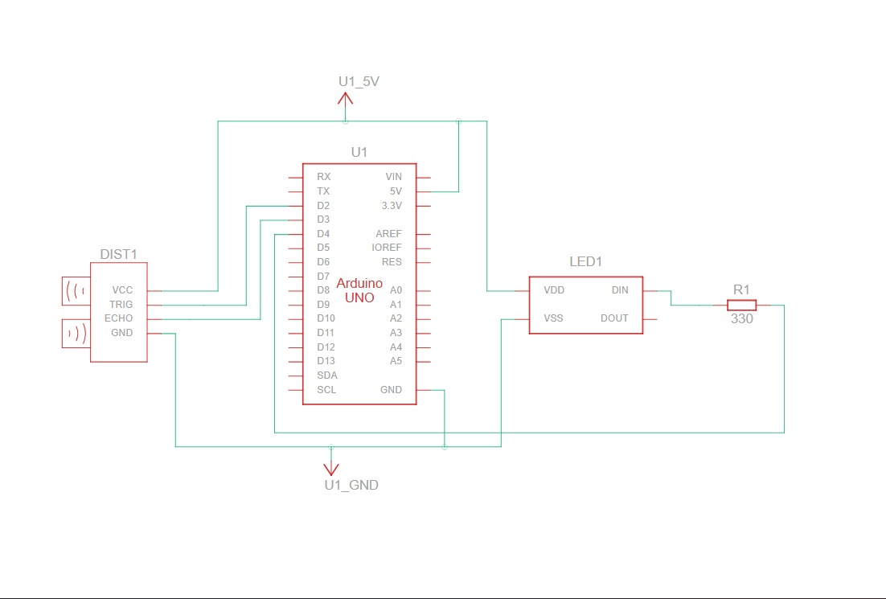
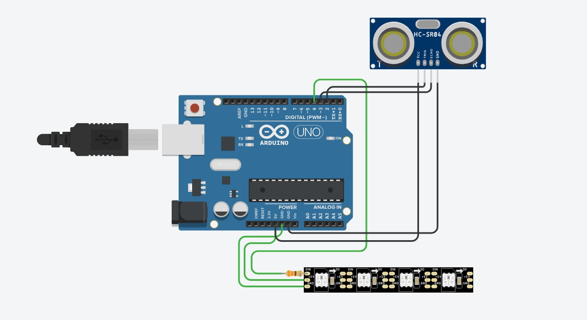

# 🌊 Ultrasonic Water Level Indicator using NeoPixel

A simple and colorful **water level indicator** built using an **ultrasonic sensor (HC-SR04)** and a **NeoPixel RGB LED strip**.  
The LEDs visually represent the water level — from **red (low)** to **green (full)** — giving an easy-to-understand display of tank status.

---

## 🧠 Project Overview

This project measures the distance from the ultrasonic sensor to the water surface and maps it to the number of LEDs lit up.  
- **Closer distance → More LEDs ON** (Full Tank)  
- **Farther distance → Fewer LEDs ON** (Empty Tank)  

The LED strip is divided into three color zones:
- 🔴 **Red**: Low water level  
- 🟡 **Yellow**: Mid water level  
- 🟢 **Green**: High water level  

---

## 🧰 Components Used

| Component | Quantity | Description |
|------------|-----------|-------------|
| Arduino (Uno / Nano / ESP32 etc.) | 1 | Main microcontroller |
| HC-SR04 Ultrasonic Sensor | 1 | Measures water distance |
| WS2812B / NeoPixel LED strip | 1 | Visual indicator |
| Jumper wires | — | Connections |
| Power supply (5V) | 1 | For both Arduino and LEDs |

---

## ⚙️ Circuit Connections

| Ultrasonic Sensor | Arduino Pin |
|--------------------|-------------|
| VCC | 5V |
| GND | GND |
| TRIG | 13 |
| ECHO | 12 |

| NeoPixel Strip | Arduino Pin |
|----------------|-------------|
| DIN | 18 |
| VCC | 5V |
| GND | GND |

 **Note:** Use a common ground between Arduino and NeoPixel strip.  
> Add a 470Ω resistor in series with the NeoPixel data line for protection.

---

## 🧭 Circuit Diagram

---

## 💡 Working Principle

1. The **HC-SR04** sensor emits ultrasonic pulses and measures the time taken for the echo to return.  
2. The **distance** to the water surface is calculated in centimeters.  
3. The distance value is **mapped** to a number of active LEDs on the strip.  
4. The LEDs light up in color zones to indicate the tank level:
   - 0–4 LEDs → Red (Low)
   - 5–8 LEDs → Yellow (Medium)
   - 9–12 LEDs → Green (Full)

---
